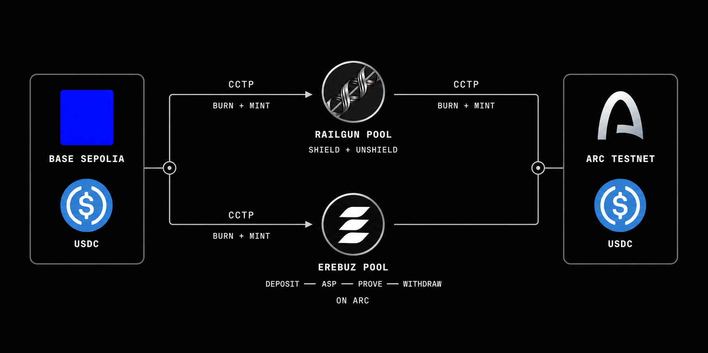

<p align="center">
  
</p>

<h1 align="center">Erebuz</h1>

<p align="center">
  Private cross-chain USDC transfers with route choice built in.
</p>

Erebuz lets a sender move USDC across chains without exposing a simple public link between the sender and recipient. The wall8 app requests quotes from the Erebuz backend, shows each available privacy route, and lets the user choose the route that fits the transfer.

This repository contains the public apps, backend services, contracts, shared packages, and the Arc privacy pool integration.

## Routes

Erebuz keeps Railgun available and adds the Erebuz Privacy Pool as a separate route. The routes are quoted independently. One does not replace the other.



| Route | Path | Purpose |
| --- | --- | --- |
|  Railgun | Base Sepolia → Circle CCTP → Railgun Pool → Circle CCTP → Arc Testnet | Private pool route with CCTP transport on both sides |
|  Erebuz | Base Sepolia → Circle CCTP → Erebuz Privacy Pool on Arc → Arc Testnet | Private pool route settled directly on Arc |

The quote response includes the route name, estimated output, fees, and expected duration. The frontend displays these routes in the quote section so the user can make an explicit choice.

## Networks and assets

| Type | Supported in the current demo |
| --- | --- |
| Source |  Base Sepolia |
| Privacy destination |  Arc Testnet |
| Asset |  USDC |
| Transport | Circle CCTP |
| Privacy providers | Railgun and Erebuz Privacy Pool |

## How a transfer works

```text
Sender
  ↓
wall8 requests private route quotes
  ↓
User selects Railgun or Erebuz Privacy Pool
  ↓
USDC is deposited on the source chain
  ↓
The selected privacy route processes the transfer
  ↓
Recipient receives USDC on the destination chain
```

For the Arc route, Circle CCTP burns USDC on Base Sepolia and mints native USDC on Arc. The Erebuz pool handles the private deposit and withdrawal flow on Arc. An automated ASP operator watches pool deposits and publishes the approval data required by the pool.

## Repository layout

```text
apps/
  app/                 wall8 transfer application
  landing/             Erebuz website
  docs/                Product documentation
  deck/                Project presentation

packages/
  tee/                 Quote and private route backend
  sdk/                 Shared types and helpers
  ui/                  Public shared UI components

contracts/             Erebuz smart contracts
infra/                 Local service stack
privacy-pool-arc/      Arc privacy pool submodule
```

The `privacy-pool-arc` directory is a Git submodule pinned to the tested Erebuz fork.

## Get started

### Requirements

- Node.js 20 or newer
- pnpm 10 or newer
- Git with submodule support

### Install

```bash
git clone --recurse-submodules https://github.com/erebuz-privacy/monorepo.git
cd monorepo
corepack enable
pnpm install
```

If the repository was cloned without submodules:

```bash
git submodule update --init --recursive
```

### Run the frontend

```bash
cp apps/app/.env.example apps/app/.env.local
pnpm app
```

Open [http://localhost:3000](http://localhost:3000).

Set `NEXT_PUBLIC_TEE_URL` in `apps/app/.env.local` to the backend you want to test. Set `NEXT_PUBLIC_TEST_MODE=true` when using Base Sepolia and Arc Testnet.

### Run the backend

```bash
cp packages/tee/.env.example packages/tee/.env
pnpm tee
```

The backend requires RPC endpoints and funded testnet service accounts for complete on-chain transfers. The example environment file lists every required value without including secrets.

## Useful commands

```bash
pnpm app
pnpm landing
pnpm docs
pnpm tee

pnpm --filter @erebuz/app build
pnpm --filter @erebuz/landing check
pnpm --filter @erebuz/tee exec tsx --test \
  src/services/private-route/fee.test.ts \
  src/services/private-route/quote.test.ts
```

Run the Arc ASP tests inside the submodule:

```bash
cd privacy-pool-arc
yarn workspace @privacy-pool-core/arc-asp test
yarn workspace @privacy-pool-core/arc-asp build
```

## Built for the Circle ecosystem

The Arc route uses Circle CCTP for native USDC movement. Erebuz adds privacy at the routing layer while keeping the asset as USDC from source to destination. This avoids wrapped liquidity and gives the frontend a clear, verifiable route to present beside the existing Railgun option.
