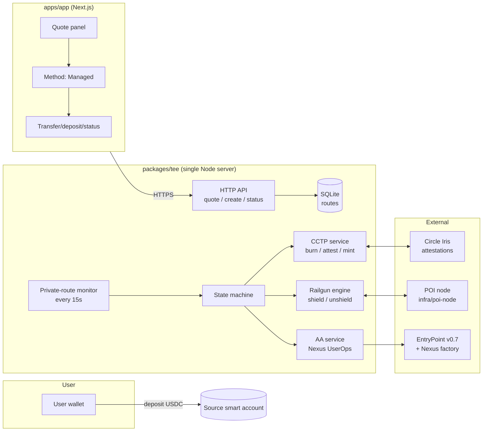
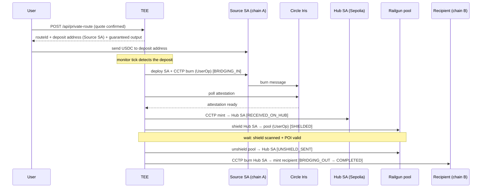

# Erebuz Private Route — Architecture, Flow & Deployment

> The complete reference for the private cross‑chain transfer system: what it is,
> how a transfer works end‑to‑end, every component, and how to run/deploy it.
> Companion to [`private-route-go-live.md`](./private-route-go-live.md) (the
> shorter go‑live checklist).

---

## 1. The goal

**Send value from chain A to chain B so that no on‑chain observer can link the
sender to the recipient.**

A normal bridge leaves a public trail: `sender → bridge → recipient`, all
correlatable. Erebuz breaks that link by routing every transfer through a
**Railgun shielded pool** on a single hub chain. Funds enter the pool from one
address and leave to a completely unrelated address; the shield/unshield pair
severs the graph. Bridging in and out of the hub is done with **Circle CCTP**
(native USDC burn/mint — no liquidity pools, no slippage).

The user experience is a Jumper/1inch‑style swap widget:

```
You send 1 USDC on Base Sepolia  →  They receive 0.8975 USDC on <any supported chain>
                                     (gas covered · anonymous)
```

The user only ever sees a quote and a deposit address. Everything else (bridging,
shielding, proving, unshielding, bridging out) is orchestrated server‑side by the
TEE and delivered automatically.

### Product surface
| Brand | wall8 (app) / Erebuz | private transfers |
| --- | --- | --- |
| `apps/app` | Next.js frontend | quote → confirm → deposit → status |
| `packages/tee` | the backend ("TEE") | one Node process: API + orchestrator + Railgun + CCTP + AA |
| `infra/poi-node` | Railgun Proof‑of‑Innocence node | required for shield/unshield |

---

## 2. High‑level architecture



**One server, all backend.** `packages/tee/index.ts` boots the HTTP API, the
Railgun engine, the deposit monitor, and the private‑route monitor in a single
process (`pnpm start`). The only external services are the POI node (self‑hosted),
Circle's Iris attestation API, and the chains' RPCs.

### The hub model
Every route funnels through **one hub chain's Railgun pool**:

- **Testnet:** hub = **Ethereum Sepolia** (`PRIVACY_HUB_CHAIN_ID=11155111`).
- **Production:** hub = **Arbitrum One** (`PRIVACY_HUB_CHAIN_ID=42161`).

Source and destination can be any supported CCTP chain; only the hub needs
Railgun + a POI node. This keeps the privacy set concentrated in one pool.

---

## 3. End‑to‑end flow (a single transfer)

A route is a database row driven through a **state machine**, one idempotent step
per monitor tick (`src/services/private-route/state-machine.ts`). States:

```
AWAITING_DEPOSIT → BRIDGING_IN → RECEIVED_ON_HUB → SHIELDED
  → UNSHIELD_SENT → BRIDGING_OUT → COMPLETED            (or → FAILED)
```

### Sequence



### Step‑by‑step (what each state does)

| State | On‑chain action | Code |
| --- | --- | --- |
| **AWAITING_DEPOSIT** | Poll the source smart account's USDC balance. When funds arrive, proceed. | `state-machine.ts` bridge‑in |
| **BRIDGING_IN** | Deploy the per‑route source smart account (first use) and CCTP‑burn its USDC to the hub SA — batched `[approve, depositForBurn]` as one self‑bundled UserOp. Store the burn tx as `leg1RequestId`. Poll Iris; when attested, `receiveMessage` mints USDC to the hub SA. | `aa.executeBatch` + `cctp.buildCctpBurnCalls` / `cctpMint` |
| **RECEIVED_ON_HUB** | The hub SA now holds USDC. Shield it into the Railgun pool — batched `[approve, shield]` UserOp from the hub SA. Store `shieldTx`. | `railgun.buildShieldCalls` + `aa.executeBatch` |
| **SHIELDED** | Wait until the shield commitment is **scanned into the merkletree AND POI‑Valid** (`waitForShieldedBalance`: refresh balances, pull POI status, generate the wallet proof). Then **unshield** `amount − serviceFee` back to the hub SA (generates a groth16 proof, ~20–30s). Store `unshieldTx`. | `railgun.waitForShieldedBalance` + `unshieldERC20` |
| **UNSHIELD_SENT / BRIDGING_OUT** | CCTP‑burn the unshielded USDC from the hub SA to the **recipient** on the destination chain. Store `leg2RequestId`. Poll Iris; when attested, `receiveMessage` mints to the recipient. | `aa.executeBatch` + `cctp` |
| **COMPLETED** | Recipient holds the delivered USDC on chain B. | — |
| **FAILED** | A hard error (recoverable "not ready" states never fail — they just retry next tick). | — |

### Why the link is broken
Legs 1–3 connect the user's deposit to the **hub SA**. The shield (leg 4) moves
those funds into the pool as a commitment; the unshield (leg 5) creates a **new,
unlinkable** output to the hub SA. Legs 6–7 deliver to the recipient. On‑chain,
there is no transaction connecting the recipient back to the depositor — only two
independent shield/unshield events against a shared pool.

### Resilience
The monitor (`monitor.ts`) runs every 15s, guards against re‑entrancy per route
(`inFlight` set), and **catches per‑route errors** — a transient failure (bridge
still settling, shield not yet scanned, POI not yet valid) leaves the route
unchanged for the next tick. Only hard failures set `FAILED`. Restarting the
server resumes all non‑terminal routes automatically (state lives in SQLite).

---

## 4. Account abstraction (per‑route smart accounts)

Each route gets its **own** deposit/hub smart account so deposits never collide
with the relayer's own balance and each route is isolated.

- **Type:** Biconomy **Nexus** (ERC‑7579) smart account, owned by the TEE signer
  EOA, via the canonical factory. Deterministic CREATE2 address from
  `(owner, routeId)` — the same address on every chain (same factory + init +
  salt), which is why the source SA and hub SA share an address.
- **Validator:** the account's **default k1Validator** (ECDSA over the owner).
  It lives in a special slot, addressed in the UserOp nonce by a **zero validator
  field** (Nexus `NonceLib` default‑validator mode) — *not* the k1Validator's real
  address (that would revert `ValidatorNotInstalled` / AA23).
- **Execution:** ERC‑7579 batch mode — `execute(mode, calldata)` with
  `callType = BATCH (0x01)` in the **first** byte of the mode word (right‑padded;
  left‑padding decodes as SINGLE and silently no‑ops).
- **Self‑bundling:** the TEE builds + signs the UserOp and submits it directly via
  `EntryPoint.handleOps` (no third‑party bundler). The TEE EOA is bundler +
  beneficiary.
- **Gas ("covered"):** before each UserOp, the TEE tops the account up to the
  op's max cost so `EntryPoint.payPrefund` succeeds; the unused portion is
  refunded to the TEE as beneficiary. A paymaster hook (`setPaymasterHook`) can
  replace this. See `src/services/aa/index.ts`.

**Canonical Nexus addresses** (same on all supported chains):

| Contract | Address |
| --- | --- |
| EntryPoint v0.7 | `0x0000000071727De22E5E9d8BAf0edAc6f37da032` |
| Nexus implementation | `0x00000000383e8cBe298514674Ea60Ee1d1de50ac` |
| NexusAccountFactory | `0x0000006648ED9B2B842552BE63Af870bC74af837` |
| NexusBootstrap | `0x0000003eDf18913c01cBc482C978bBD3D6E8ffA3` |
| k1Validator | `0x0000000031ef4155C978d48a8A7d4EDba03b04fE` |

A chain is "AA‑ready" only if these are deployed there (checked in
`isAaReady`). All 5 enabled testnets pass.

---

## 5. Bridging — Circle CCTP v2

CCTP burns USDC on the source and mints native USDC on the destination via
Circle's attestation service — 1:1, no slippage, no liquidity caps
(`src/services/cctp/index.ts`).

- **Contracts (testnet, identical on every chain):** TokenMessengerV2
  `0x8FE6B999Dc680CcFDD5Bf7EB0974218be2542DAA`, MessageTransmitterV2
  `0xE737e5cEBEEBa77EFE34D4aa090756590b1CE275`.
- **Attestation:** Iris sandbox `https://iris-api-sandbox.circle.com`
  (`CCTP_IRIS_API` to override; use the mainnet Iris URL in prod).
- **Flow:** `depositForBurn(amount, destDomain, mintRecipient, burnToken,
  destinationCaller=0, maxFee, minFinalityThreshold)` → poll
  `/v2/messages/{srcDomain}?transactionHash=…` → `receiveMessage(message,
  attestation)`.
- **Finality:** non‑instant chains use **Fast Transfer** (`1000`); instant‑final
  chains (Avalanche, Polygon, Sonic, Sei…) use **standard** (`2000`) — Fast
  Transfer isn't offered when the source is instant‑final.
- **Domains** are Circle's, not chain IDs (e.g. Ethereum 0, Avalanche 1, OP 2,
  Arbitrum 3, Base 6). The chain table maps them.

---

## 6. Privacy leg — Railgun

`src/services/railgun/index.ts` wraps `@railgun-community/wallet` + `engine`.

- **Shield:** `[approve(proxy), shield]` — the hub SA deposits USDC into the pool
  to the TEE's `0zk` address (shield key derived deterministically from the TEE
  signer).
- **Unshield:** `gasEstimateForUnprovenUnshield` → `generateUnshieldProof`
  (groth16 via snarkjs) → submit; the public TEE EOA pays gas.
- **Proof of Innocence (POI):** a shield can only be spent once the POI node has
  listed it and the wallet has a **Valid** proof for it. `waitForShieldedBalance`
  drives `refreshBalances` + `refreshReceivePOIsForWallet` +
  `generatePOIsForWallet` and blocks the unshield until POI‑Valid.
- **Engine init** (`initRailgunEngine`): uses a `leveldown` store, wires the
  groth16 prover, clears the default `POI_REQUIRED_LISTS` (Chainalysis) and
  registers the self‑hosted node's list key, and loads a single‑provider config
  (avoids FallbackProvider quorum stalls). Runs at server boot for
  `PRIVACY_HUB_CHAIN_ID`.

---

## 7. Fee model — who pays what

The **quoted output is what the recipient actually receives** (`delivered ≥
quoted`, never less). `src/services/private-route/fee.ts`:

```
serviceFee      = max(PRIVATE_ROUTE_FEE_MIN_USD, PRIVATE_ROUTE_FEE_BPS)   ← our margin
unshieldAmount  = amount − serviceFee                                     ← what we unshield
privacyFee      = unshieldAmount × 0.25%   (Railgun unshield fee)         ← borne by user
bridgeFee       = (unshieldAmount − privacyFee) × 0.03%  (CCTP dest leg)  ← borne by user
quotedOutput    = unshieldAmount − privacyFee − bridgeFee                 ← delivered ≥ this
```

Who bears which fee:

| Fee | Bearer | Why |
| --- | --- | --- |
| Service fee | user | our margin / spread |
| Railgun **unshield** 0.25% | **user** | applies to the amount we pull out → reduces delivered |
| Railgun **shield** 0.25% | **us (margin)** | we shield the full amount but unshield only `amount − serviceFee`; the shield fee shrinks the leftover pool surplus, not the delivered amount |
| CCTP leg‑1 (in) | us (margin) | reduces what reaches the pool, absorbed by spread |
| CCTP leg‑2 (out) | user | applies to the dest burn → reduces delivered |

**Delivered depends only on the unshield + dest‑CCTP fees** — doubling the shield
fee would not change what the recipient gets, only our margin.

**Solvency invariant:** because we absorb the shield + leg‑1 fees, the service fee
must exceed `shieldFee + cctpIn` or the pool couldn't cover the unshield. Holds by
a wide margin (`max($0.10, 1.5%)` vs ~0.26%). On large mainnet amounts where the
CCTP fast fee can approach its cap, keep an eye on this.

Defaults: `PRIVATE_ROUTE_FEE_BPS=150` (1.5%), `PRIVATE_ROUTE_FEE_MIN_USD=1`
(lower to `0.1` for small testnet demos).

---

## 8. Supported chains

Enabled = verified USDC address **+** Nexus deployed (for per‑route source SAs)
**+** working RPC. Defined in one table in `src/services/cctp/index.ts`.

**Testnet (hub = Ethereum Sepolia):**

| Chain | Chain ID | CCTP domain | USDC |
| --- | --- | --- | --- |
| Ethereum Sepolia | 11155111 | 0 | `0x1c7D4B196Cb0C7B01d743Fbc6116a902379C7238` |
| Base Sepolia | 84532 | 6 | `0x036CbD53842c5426634e7929541eC2318f3dCF7e` |
| Arbitrum Sepolia | 421614 | 3 | `0x75faf114eafb1BDbe2F0316DF893fd58CE46AA4d` |
| OP Sepolia | 11155420 | 2 | `0x5fd84259d66Cd46123540766Be93DFE6D43130D7` |
| Avalanche Fuji | 43113 | 1 | `0x5425890298aed601595a70AB815c96711a31Bc65` |

**Mainnet (hub = Arbitrum):** Ethereum, Base, Arbitrum (extend as verified).

`cctpChains()` filters to the hub's network class, so a testnet hub only ever
offers testnet chains.

### Adding a chain
1. Add a row to `CCTP_CHAINS` in `cctp/index.ts` (domain, **verified** USDC,
   name, testnet flag, `instantFinality` if applicable).
2. If it should be a **source**, add a chain config JSON under
   `src/config/web3/chains/` (RPC `url`, USDC token, the canonical Nexus
   contracts) and make sure Nexus is actually deployed there. Dest‑only chains
   just need CCTP + an RPC.
3. Fund the relayer EOA with that chain's native gas.

> Circle's reference SDK lists a **placeholder** USDC for several newer chains
> (Arc, Sonic, Sei, Unichain, Linea, …) — do **not** enable those until you've
> verified the real USDC address, or routes will break.

---

## 9. Repository layout

```
packages/tee/
  index.ts                         # single server: API + monitors + Railgun boot
  src/config/
    load-env.ts                    # loads .env / .env.railgun.local on boot (dev)
    global-config.ts               # env-driven config (hub, fees, provider, …)
    web3/chains/*.json             # per-chain config (RPC, tokens, Nexus contracts)
  src/services/
    private-route/
      create.ts                    # create route (+ CCTP variant)
      quote.ts                     # preview quote (no persist)
      fee.ts                       # service + protocol fee math
      state-machine.ts             # the 7-state orchestrator
      monitor.ts                   # 15s poller
    cctp/index.ts                  # CCTP chain table + burn/attest/mint
    aa/index.ts                    # Nexus UserOp build/sign/self-bundle + gas
    railgun/index.ts               # shield / unshield / POI / engine
    relay/index.ts                 # alternative bridge (BRIDGE_PROVIDER=relay)
  src/api/routes/
    private-route.ts               # quote / create / status handlers
    relay.ts                       # chain + token discovery
  src/scripts/                     # test:aa, test:cctp, test:sepolia, test:e2e, …
apps/app/
  src/lib/tee.ts                   # typed TEE client
  src/lib/tee-data.ts              # chain/token hooks (cached)
  src/lib/route-draft.tsx          # in-memory draft across screens
  src/components/quote-panel.tsx   # public quote screen
  src/components/crypto-icon.tsx   # web3icons glyphs (AssetGlyph/ChainGlyph/…)
  src/app/page.tsx                 # → quote panel
  src/app/method/page.tsx          # Managed sign-in + createRoute
  src/app/transfer/page.tsx        # deposit address + QR + live status polling
infra/
  poi-node/                        # self-hosted Railgun POI node (Docker)
  stack/                           # one-command backend stack (mongo+poi+tee)
```

---

## 10. Configuration reference (TEE env)

| Var | Purpose | Default |
| --- | --- | --- |
| `PORT` | API port | `3000` |
| `BRIDGE_PROVIDER` | `cctp` (native USDC) or `relay` (any token) | `relay` |
| `PRIVACY_HUB_CHAIN_ID` | Railgun hub chain | `42161` (prod) / `11155111` (test) |
| `PRIVACY_HUB_TOKEN_SYMBOL` | shielded hub token | `USDC` |
| `PRIVATE_KEY` | funded relayer/signer EOA (gas + self-bundling) | — (required) |
| `RAILGUN_MNEMONIC` | Railgun wallet mnemonic | — (required) |
| `RAILGUN_ENCRYPTION_KEY` | Railgun wallet encryption key | — (required) |
| `RAILGUN_POI_NODE_URL` | POI aggregator URL | — (required for privacy leg) |
| `RAILGUN_RPC_<chainId>` | RPC for the hub chain (e.g. `RAILGUN_RPC_11155111`) | built-in public RPC |
| `RPC_<chainId>` | RPC override for a chain (CCTP/balances) | chain config `url` |
| `CCTP_IRIS_API` | attestation API base | sandbox |
| `PRIVATE_ROUTE_FEE_BPS` | service fee bps | `150` |
| `PRIVATE_ROUTE_FEE_MIN_USD` | service fee floor | `1` |
| `PRIVATE_ROUTE_MONITOR_INTERVAL_MS` | monitor tick | `15000` |
| `DATABASE_PATH` | SQLite path | `./data/tee.db` |
| `RAILGUN_DB_PATH` / `RAILGUN_ARTIFACT_PATH` | Railgun leveldb + circuits | `./data/*` |

Secrets live in gitignored files: repo‑root `.env` (or `packages/tee/.env`),
`packages/tee/.env.railgun.local` (mnemonic + encryption key), `infra/*/.env`,
`apps/app/.env.local`. **Never commit them.** For local dev, `load-env.ts` reads
these on boot (and maps `TEST_PRIVATE_KEY → PRIVATE_KEY`); in Docker the compose
env wins.

App env (`apps/app/.env.local`):
```
NEXT_PUBLIC_TEE_URL=http://localhost:3005     # the TEE API base
NEXT_PUBLIC_TEST_MODE=true                    # testnet chains + testnet defaults
```

---

## 11. Deployment

### 11.1 Generate the Railgun wallet (once)
```bash
pnpm --filter @erebuz/tee gen:railgun-keys
# writes RAILGUN_MNEMONIC + RAILGUN_ENCRYPTION_KEY (keep secret; never print/commit)
```

### 11.2 One‑command backend stack (recommended)
Brings up Mongo + POI node + TEE, wired together (`infra/stack`):
```bash
cd infra/stack
cp .env.example .env            # fill in secrets + hub config
# generate the POI ed25519 pair once and paste pkey/pubkey:
docker compose run --rm --no-deps poi-node node src/config/keyGenerator.js
docker compose --env-file .env up -d --build
```
Key `.env` values:
- `MONGO_PASSWORD` — `openssl rand -hex 24`
- `pkey` / `pubkey` — POI list‑provider keypair
- `PRIVATE_KEY`, `RAILGUN_MNEMONIC`, `RAILGUN_ENCRYPTION_KEY`
- `PRIVACY_HUB_CHAIN_ID` + matching `RAILGUN_RPC_<id>` (use your own Alchemy/Infura)
- `ACTIVE_NETWORKS` — pin the POI node's synced chains (`Arbitrum` prod /
  `Ethereum_Sepolia` test); public RPCs 403 on full mainnet sync and crash‑loop.
- **Testnet self‑peering** (required so the node validates its own TXID merkletree
  before unshields work): set
  `NODE_CONFIGS=[{"name":"self","nodeURL":"http://poi-node:8080","listKey":"<64hex from /node-status-v2>"}]`

Exposure: everything binds to `127.0.0.1` by default. Put a TLS reverse proxy
(Caddy/nginx) in front of the TEE and set `NEXT_PUBLIC_TEE_URL` to its https URL.
Only set `TEE_BIND=0.0.0.0` / `POI_BIND=0.0.0.0` behind such a proxy.

### 11.3 POI node standalone
If you want the POI node separately, `infra/poi-node` has its own compose +
README (same steps). Verify with `curl localhost:8080/node-status-v2`.

### 11.4 Run the TEE without Docker (dev)
```bash
cd packages/tee
# env from local files (load-env) + inline overrides:
BRIDGE_PROVIDER=cctp PRIVACY_HUB_CHAIN_ID=11155111 PORT=3005 \
RAILGUN_POI_NODE_URL=http://localhost:8080 \
RAILGUN_RPC_11155111=https://ethereum-sepolia-rpc.publicnode.com \
PRIVATE_ROUTE_FEE_MIN_USD=0.1 \
pnpm start
```

### 11.5 App
```bash
# apps/app/.env.local → NEXT_PUBLIC_TEE_URL (the TEE), NEXT_PUBLIC_TEST_MODE=true
pnpm --filter @erebuz/app dev        # dev
pnpm --filter @erebuz/app build      # prod build (Vercel deploy per repo AGENTS.md)
```

### 11.6 Fund the relayer
The relayer EOA (`PRIVATE_KEY`) needs **native gas on every source and
destination chain** used (it self‑bundles the burns and submits the mints), plus
gas on the hub for shield/unshield. The hub also needs the relayer to be able to
pay Railgun gas. Fund each chain you enable.

---

## 12. Local development & testing

Standalone harnesses (each loads local env via `load-env`):

| Script | What it proves |
| --- | --- |
| `pnpm --filter @erebuz/tee gen:railgun-keys` | generate the Railgun wallet |
| `pnpm --filter @erebuz/tee test:aa` | Nexus AA path: deploy + default‑validator UserOp + ERC‑7579 batch (no funds moved — a zero‑value `approve`) |
| `pnpm --filter @erebuz/tee test:cctp` | CCTP round trip: burn Base Sepolia → mint Sepolia |
| `pnpm --filter @erebuz/tee test:sepolia` | Railgun shield → unshield on Sepolia (needs the POI node) |
| `pnpm --filter @erebuz/tee test:e2e -- --amount=1` | **full route**: create → fund source SA → drive to COMPLETED, asserts delivered ≥ quoted |
| `pnpm --filter @erebuz/tee verify:route` | route API health check |

`test:e2e` env (matches the server):
```bash
BRIDGE_PROVIDER=cctp PRIVACY_HUB_CHAIN_ID=11155111 \
DATABASE_PATH=<path>/tee.sqlite \
RPC_84532=https://base-sepolia-rpc.publicnode.com \
RAILGUN_RPC_11155111=https://ethereum-sepolia-rpc.publicnode.com \
RAILGUN_POI_NODE_URL=http://localhost:8080 PRIVATE_ROUTE_FEE_MIN_USD=0.1 \
pnpm --filter @erebuz/tee test:e2e -- --amount=1
```

---

## 13. API reference

Base: `NEXT_PUBLIC_TEE_URL`. All responses: `{ success, data }` (or
`{ success:false, error }`). CORS `*`.

| Method / Path | Body / Query | Returns |
| --- | --- | --- |
| `POST /api/private-route/quote` | `{ sourceChainId, destChainId, amount, tokenSymbol }` | quote incl. `quotedOutputAmount`, `feeAmount`, `bridgeFeeAmount`, `privacyFeeAmount`, `route`, `etaSeconds` (no persist) |
| `POST /api/private-route` | `{ …quote, userDestinationAddress }` | `{ routeId, depositAddress, hubAccount, quotedOutputAmount, … }` |
| `GET /api/private-route/:routeId` | — | full route record + `status` |
| `GET /api/relay/chains` | — | supported chains (CCTP mode → the enabled testnets) |
| `GET /api/relay/tokens?chainId=` | `chainId` | tokens (CCTP mode → USDC only) |

Frontend usage: `quote()` on keystroke → `createRoute()` on confirm → poll
`getRoute()` every 4s until `COMPLETED`/`FAILED` (`src/lib/tee.ts`).

---

## 14. Operations & troubleshooting

| Symptom | Cause / fix |
| --- | --- |
| Route stuck at `AWAITING_DEPOSIT` | Deposit not detected — user sent to the wrong address, or nothing sent. Check the source SA's USDC balance on chain A. |
| Route stuck at `SHIELDED` (unshield: "spendable balance too low") | The POI node hasn't listed/attested the shield yet. Check `/node-status-v2` `shieldQueueStatus.latestShield`; if the scanner is stale, **restart the POI node** to catch it up. The route resumes automatically. |
| `RECEIVED_ON_HUB` never advances | Railgun not ready (no POI node / hub RPC), or hub SA has no gas. Check boot logs for "Railgun engine ready". |
| AA23 `ValidatorNotInstalled` | Nonce validator field must be **zero** (default‑validator mode) — see AA service. |
| Handleops succeeds but nothing executed | ERC‑7579 mode byte order — batch mode must be right‑padded. |
| `latestShield: N hours ago` while a new shield is fresh | POI list‑provider scanner stalled; restart the node. |
| Delivered < quoted | Should never happen; the quote nets unshield + dest‑CCTP fees. If it does, the CCTP fast fee exceeded the quote estimate — tie the estimate to the burn `maxFeeBps`. |

Health checks: `curl localhost:3005/api/relay/chains` (TEE), `curl
localhost:8080/node-status-v2` (POI). The private‑route monitor logs each state
transition.

---

## 15. Security

- **TEE key custody:** `PRIVATE_KEY` owns the per‑route smart accounts and pays
  gas; `RAILGUN_MNEMONIC`/`RAILGUN_ENCRYPTION_KEY` own the shielded pool. Treat
  all three as hot‑wallet secrets. Never log/print/commit them. In production run
  inside a real trusted execution environment (the "TEE" name).
- **Secrets** are gitignored (`.env*`, `infra/*/.env`) and the CI/commit path
  scans for key‑like literals. Rotate anything that ever touched a repo file.
- **POI screening:** the self‑hosted node clears the default Chainalysis list;
  set a `CHAINALYSIS_API_KEY` if you need OFAC screening on shields.
- **Exposure:** bind services to localhost and front them with TLS. Mongo is never
  published.

---

## 16. Known limitations & roadmap

- **Testnet‑first.** The validated path is CCTP testnets → Sepolia hub. Mainnet
  needs the Arbitrum hub configured + a mainnet POI node + funded relayer.
- **USDC‑only bridging.** CCTP moves native USDC; other tokens need a swap
  provider (USDC↔token) on the in/out legs (Relay path exists behind
  `BRIDGE_PROVIDER=relay` for arbitrary tokens, liquidity‑capped).
- **Per‑route isolation needs Nexus** on the source chain; chains without it can
  only be destinations.
- **CCTP fee estimate vs cap** — the quote assumes a small dest‑leg fee; on
  mainnet, tie it to the actual `maxFeeBps` so `delivered ≥ quoted` always holds.
- **Solvency guard** for the shield‑fee margin is currently implicit — worth
  making explicit before mainnet.
- **Managed custody only** in the app; self‑custody signing is "coming soon".
```
